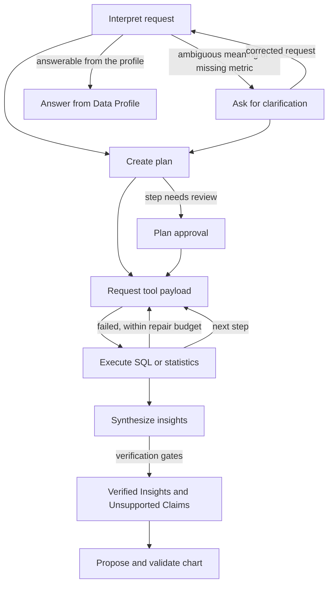

# Tabular Analytics Agent

A local-first AI analyst for CSV and XLSX files. You upload a table and ask a question in English
or Vietnamese. The agent plans the analysis, runs read-only SQL and statistical tests, and publishes
only conclusions whose numbers pass deterministic verification.

The language model plans and interprets. It never computes a number, and it never writes the final
claim text.

## Status

The MVP scope in [Spec.md](./Spec.md) is implemented: 11 of the 14 acceptance criteria in Spec
Section 21 were already met, and packaging, setup documentation, and the limitations document are
added in this release. Automated tests do not call a model. The Docker image has not been built on
the development machine because Docker is not installed there; the check target that would verify
it is included. Evidence for every claim is in
[docs/mvp-acceptance.md](./docs/mvp-acceptance.md), and known weaknesses are in
[docs/limitations.md](./docs/limitations.md).

## What it does

- **Safe ingestion and profiling.** CSV and XLSX uploads are validated (size, zip-bomb, and
  encoding checks), stored immutably, and profiled: field types, missing values, duplicates,
  outliers, identifier-like fields, possible PII, and values spelled inconsistently (case or
  spaces).
- **Data Overview.** Right after upload, deterministic charts describe the data, including a
  correlation heatmap. An explorer lets you chart any measure by group, time period, and filters.
  No model is called.
- **Goal suggestions.** Up to five questions are proposed from the profile (three or more for most
  datasets).
- **Clarification.** When a requested metric does not exist, or a field meaning changes the
  answer, the agent asks instead of guessing.
- **Inspectable plans.** Each question becomes a plan of typed steps. Steps flagged for review
  pause for your approval.
- **Deterministic tools.** Read-only DuckDB SQL under a validating policy, and ten statistical
  operations in NumPy and SciPy with assumption checks and multiple-testing correction.
- **Verified Insights.** Every conclusion links to its evidence: the exact query or test, source
  fields, filters, and values. Claims that fail a gate are shown as unsupported.
- **Dashboard and export.** Validated Plotly charts can be pinned. Results export to CSV and JSON.
- **Durable sessions.** Checkpointed with LangGraph and SQLite; sessions survive restarts and can be
  deleted.

## Why the results can be trusted, and where they cannot

| Guarantee | How it is enforced |
|---|---|
| Numbers come from tools, not the model | Claims are rendered from typed assertions over exact evidence values |
| Only read-only access to the session table | SQL is parsed with sqlglot; DDL, DML, external access, and other tables are rejected |
| Uploaded text cannot act as instructions | Cell values, headers, the user's question, and tool errors are delimited and escaped as untrusted data |
| Runs are bounded | Tool Action, repair, query, model-call, and run-time budgets, all configurable |
| Personal data is withheld | Values of likely PII fields are never sent to the model |

Verification proves that a number is correct for the query that produced it. It does not prove the
query answers your question. On messy data, a correctly filtered total can still miss rows spelled
differently. Read [docs/limitations.md](./docs/limitations.md) before relying on a result.

## Evaluation

Each holdout set uses datasets unseen by earlier sets, with expected values computed independently
in pandas and SciPy and committed before the first run. Every case runs 3 times against
`gemini-3.5-flash-lite`.

| Set | Passed | What it measured |
|---|---|---|
| v3 | 25/30 (83.3%) | Vietnamese maintenance log, support tickets |
| v4 | 33/36 (91.7%) | Iris, Titanic, student scores, messy orders |
| v5 | 29/36 (80.6%) | coffee sales (Vietnamese), clinic appointments; 32/36 after a grader fix |
| v6 | 30/36 (83.3%) | library loans (Vietnamese), energy meters; exposed a regression, then fixed |
| v7 | 36/36 (100%) | admissions (Vietnamese), farm harvest; clear questions, clean data |
| v8 | 24/36 (66.7%) | hard set: inconsistent spellings, numbers stored as text, vague and multi-step questions |
| v9 | 20/36 (55.6%) | hotel bookings (Vietnamese), SaaS subscriptions; measured three fixes made after v8 |

v7 and v8 bracket the realistic range: reliable on clear questions over clean data, much weaker on
inconsistent values and vague requests. v9 confirmed that inconsistent spellings are now handled
and found new weak points: pooled multi-step answers, table-qualified field ids (since fixed), and chart choice
for one-row results (six v9 failures were chart-only, with correct numbers). The samples are small
(36 runs per set), so treat each score as a range, not a precise rate. Details are in
[docs/limitations.md](./docs/limitations.md).

## Quick start

Python 3.12 and a Gemini API key are required for live analysis. Tests need no key.

### Local

```powershell
python -m venv .venv
.\.venv\Scripts\Activate.ps1
python -m pip install --constraint constraints.txt --editable ".[dev]"
Copy-Item .env.example .env   # then set GOOGLE_API_KEY in .env
python -m streamlit run streamlit_app.py
```

On macOS or Linux, activate with `source .venv/bin/activate` and copy with `cp .env.example .env`.
`constraints.txt` pins the dependency versions the test suite passed with.

On Windows, installation can fail with a long-path error because a dependency (pyarrow) ships deeply
nested header files. Keep the repository in a short folder, such as `C:\src\tabular-analytics-agent`,
or enable Windows long-path support.

### Docker

```bash
docker build --target runtime -t tabular-analytics-agent .
docker run --rm -p 8501:8501 --env-file .env -v taa-data:/data tabular-analytics-agent
```

Open <http://localhost:8501>. Session data lives in the `taa-data` volume, and the API key is passed
at run time and never copied into the image.

To verify a release in a clean Linux environment, build the check target. It fails unless linting,
formatting, strict type checking, and the full test suite with its 90% coverage threshold pass:

```bash
docker build --target check .
```

## Configuration

Settings are read from environment variables or `.env`. The full list with defaults is in
[.env.example](./.env.example).

| Variable | Purpose | Default |
|---|---|---|
| `GOOGLE_API_KEY` | Gemini key; comma-separated keys rotate at 15 requests per minute each | required for live runs |
| `TABULAR_AGENT_MODEL` | Model identifier | `gemini-3.5-flash-lite` |
| `TABULAR_AGENT_DATA_DIR` | Where sessions and artifacts are stored | `.data` |
| `TABULAR_AGENT_SEND_SAMPLE_VALUES` | Set to `false` to send no frequent field values to the model | `true` |
| `TABULAR_AGENT_MAX_QUERY_ROWS`, `TABULAR_AGENT_RUN_TIMEOUT_SECONDS`, and other `TABULAR_AGENT_*` limits | Resource limits and run budgets | see `.env.example` |

Before sending real customer data, read Spec Section 14.5: field metadata and verified result
values still reach the model provider, and free API tiers may allow the provider to use them.

## How it works



The application is layered so that Streamlit and the model provider are replaceable adapters:

```text
streamlit_app.py            Streamlit delivery adapter
application/                Use cases: sessions, Data Overview, exports, settings, suggestions
orchestration/              LangGraph state machine, prompts, plan and tool binding, budgets
model_gateway/              Provider-neutral structured generation; Gemini and fake adapters
data/                       Ingestion, profiling, SQL policy, and read-only DuckDB queries
statistics/                 Deterministic statistical tests
verification/               Evidence gates and deterministic claim rendering
visualization/              Chart validation, Plotly rendering, artifact lifecycle
domain/                     Validated contracts shared by every layer
evaluation/                 Golden cases and the live evaluation runner
```

Module responsibilities and seams are described in [docs/architecture.md](./docs/architecture.md).
Domain terms are defined in [CONTEXT.md](./CONTEXT.md).

## Development

```powershell
python -m ruff check .
python -m ruff format --check .
python -m mypy
python -m pytest
```

The live evaluation runner uses API quota and paces requests:

```powershell
python -m tabular_analytics_agent.evaluation.runner --cases tests/evaluation_cases_holdout_v7 --runs 3 --rpm 30
```

Results are written to `.eval/<timestamp>/`. Never commit API keys, `.env`, or real user data.

## Roadmap after the MVP

- A local model adapter so no data leaves the machine, evaluated against the same gates.
- Automatic normalization of inconsistent category values, and cleaning steps as versioned Working
  Dataset transformations.
- Result passing between plan steps for multi-step questions.
- Per-organization privacy settings and authentication.
- A React and FastAPI front end once the conditions in Spec Section 20 are met.
- Screenshots, a demo video, and sales, manufacturing, and workforce case studies, which are not
  part of this MVP release.

## License

MIT. See [LICENSE](./LICENSE).
