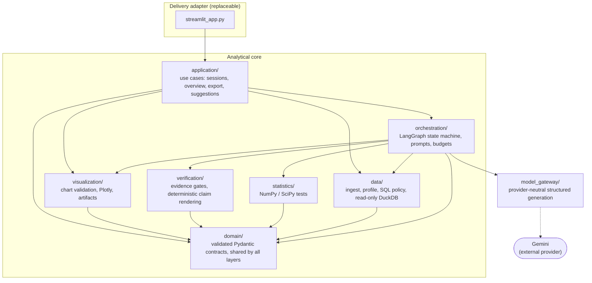
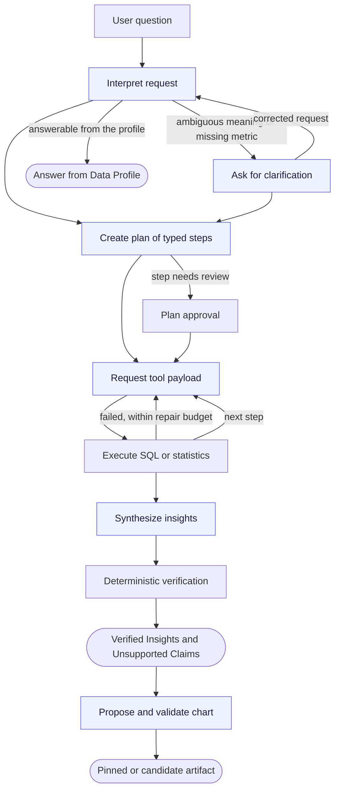

# Tabular Analytics Agent

A local-first AI data analyst for CSV and XLSX files. You upload a table and ask a question in
English or Vietnamese. The agent plans the analysis, runs read-only SQL and statistical tests, and
publishes only conclusions whose numbers pass deterministic verification.

**The language model plans and interprets. It never computes a number, and it never writes the final
claim text.** Every published conclusion is rendered from typed assertions over exact tool output,
so a number a user sees always traces back to a query or a statistical test, not to the model.

Statistical calculations run on all rows in the approved analysis scope; the MVP never samples
automatically.

**▶ Live demo:** <https://tabular-analyst-agent.streamlit.app/> — deployed on Streamlit Community
Cloud. It runs on a free Gemini tier, so analysis may be rate-limited; the deterministic parts
(upload, Data Profile, Data Overview) work regardless.

- **Stack:** Python 3.12 · LangGraph · DuckDB · NumPy/SciPy · sqlglot · Plotly · Streamlit ·
  Pydantic v2 · Gemini (`gemini-3.5-flash-lite`)
- **Quality:** ~530 automated tests (none call a model), branch coverage ≥ 90%, strict mypy, Ruff,
  and a Docker `check` image that runs all of it in a clean Linux environment on CI.

## Screenshots

Try it live at <https://tabular-analyst-agent.streamlit.app/>. Screenshots and a short demo video
will be added here.

<!--
Save images to docs/images/ then uncomment and adjust the paths below.

| Data Profile | Verified insights |
|---|---|
|  |  |

| Statistical comparison | Chart with alternate chart type |
|---|---|
|  |  |

Demo video (drag an .mp4 into a GitHub issue or release to get a hosted URL, then paste it here):

https://github.com/AnhPhiNe/data_analyst_agent/assets/...
-->

## What it does

- **Safe ingestion and profiling.** CSV and XLSX uploads are validated (size, zip-bomb, and
  encoding checks), stored immutably, and profiled: field types, missing values, duplicates,
  outliers, identifier-like fields, possible PII, and values spelled inconsistently (case or
  spaces).
- **Data Overview.** Right after upload, deterministic charts describe the data, including a
  correlation heatmap. An explorer charts any measure by group, time period, and filters. No model
  is called.
- **Goal suggestions.** Three to five questions are proposed from the profile.
- **Clarification.** When a requested metric does not exist, or a field meaning would change the
  answer, the agent asks instead of guessing.
- **Inspectable plans.** Each question becomes a plan of typed steps. Steps flagged for review pause
  for your approval.
- **Deterministic tools.** Read-only DuckDB SQL under a validating policy, and ten statistical
  operations in NumPy and SciPy with assumption checks and multiple-testing correction. Statistical
  operations read every row in the approved scope; `TABULAR_AGENT_MAX_QUERY_ROWS` only limits rows
  returned for display or model context.
- **Verified Insights.** Every conclusion links to its evidence: the exact query or test, source
  fields, filters, and values. A claim that fails a check is shown as unsupported instead of being
  published.
- **Dashboard and export.** Validated Plotly charts can be pinned. The chart vocabulary is KPI,
  table, bar, line, scatter, histogram, and box plot, and a candidate can be shown as another of
  these over the same verified result without another model call. Results export to CSV and JSON.
- **Durable sessions.** Checkpointed with LangGraph and SQLite; sessions survive restarts and can be
  deleted.

## Why the results can be trusted, and where they cannot

| Guarantee | How it is enforced |
|---|---|
| Numbers come from tools, not the model | Claims are rendered from typed assertions over exact evidence values |
| Only read-only access to the session table | SQL is parsed with sqlglot; DDL, DML, external access, and other tables are rejected |
| Uploaded text cannot act as instructions | Cell values, headers, the user's question, and tool errors are delimited and escaped as untrusted data |
| Runs are bounded | Tool Action, repair, query, model-call, and run-time budgets, all configurable |
| Statistical scope is explicit | Results record dataset, population, loaded, valid, and missing row counts; verification rejects partial or truncated input |
| Personal data is withheld | Values of likely PII fields are never sent to the model |

Verification proves that a number is correct for the query that produced it. It does not prove the
query answers your question. On messy data, a correctly filtered total can still miss rows spelled
differently. Read [docs/limitations.md](./docs/limitations.md) before relying on a result.

## Architecture

The system is layered so that the user interface and the model provider are **replaceable
adapters**: the analytical core runs, and is tested, without Streamlit and without a live model.



Provider-specific types never leave the `model_gateway` adapter, and no analytical module imports the
Streamlit UI. Module responsibilities and seams are detailed in
[docs/architecture.md](./docs/architecture.md); domain terms are defined in [CONTEXT.md](./CONTEXT.md).

```text
streamlit_app.py   Streamlit delivery adapter
application/        Use cases: sessions, Data Overview, exports, settings, suggestions
orchestration/     LangGraph state machine, prompts, plan and tool binding, budgets
model_gateway/     Provider-neutral structured generation; Gemini and fake adapters
data/              Ingestion, profiling, SQL policy, and read-only DuckDB queries
statistics/        Deterministic statistical tests
verification/      Evidence gates and deterministic claim rendering
visualization/     Chart validation, Plotly rendering, artifact lifecycle
domain/            Validated contracts shared by every layer
evaluation/        Golden cases and the live evaluation runner
```

## Analysis pipeline

Every question flows through the same checkpointed state machine. The model decides *what* to do at
the shaded steps; deterministic code does everything that touches a number.



The shaded steps are the only ones that call the model. Verification, SQL execution, statistics, and
chart validation are deterministic, so the same evidence always yields the same published claim.

## Evaluation

The agent is measured with an offline **evaluation runner** against golden cases on held-out
datasets. Numerical correctness is graded deterministically; natural-language quality is reviewed by
hand against a rubric.

### How it is measured

- **Independent ground truth.** Every case's expected values are computed separately in pandas and
  SciPy and committed **before** the first live run, so results cannot be fitted to the model's
  output.
- **Held-out data.** Each set uses datasets unseen by earlier sets. The release suite's questions
  were written outside the repository, without access to the code.
- **Measured once, not tuned.** A suite is run and its expectations are never edited afterwards.
  Each case runs three times against `gemini-3.5-flash-lite` to expose run-to-run variance.
- **Read by hand.** In addition to automatic grading, every stored run was inspected manually to
  confirm the filters, units, and conclusions were right — not just the numbers.

### What each metric means

| Metric | What it measures |
|---|---|
| Calculation accuracy | Share of the independently computed expected values that appear in the agent's results, within tolerance |
| Schema grounding | Share of fields used by successful Tool Actions that were allowed for the case — i.e. the agent did not invent or misuse columns |
| Unsupported-claim rate | Share of published insights that contain a forbidden claim, such as asserting causation from a correlation (lower is better) |
| Tool execution success | Share of tool-executing runs that finished without exhausting the repair budget |
| Chart validity | Share of cases that expect a chart which rendered one of the valid chart types |
| Evidence completeness | Share of Verified Insights that carry a complete Evidence Trail (query or test, source fields, filters, values) |
| Clarification recall | Share of cases that should ask for clarification where the agent did; unnecessary clarifications are reported separately |
| End-to-end success | Share of runs that pass every check above |

### Results

Measured rates on the release suite — 40 cases on nine unseen datasets, three runs each, measured
once, with provider-error runs reported separately:

| Metric | Release suite |
|---|---|
| Calculation accuracy | 161/177 (91.0%) |
| Schema grounding | 157/157 (100%) |
| Unsupported-claim rate | 0/292 (0%) |
| Tool execution success | 74/75 (98.7%) |
| Chart validity | 56/60 (93.3%) |
| Evidence completeness | 292/292 (100%) |
| Clarification recall | 30/30 (100%) |
| End-to-end success | 108/120 (90.0%) |

The 95% Wilson interval on the end-to-end rate is roughly 83–94% on this sample. A 10-case final
holdout on two further unseen datasets passed 30/30 graded runs. The quality bars we set for
ourselves, the runs that fell short of them, and why each was left unfixed are documented in full in
[docs/limitations.md](./docs/limitations.md) and [docs/mvp-acceptance.md](./docs/mvp-acceptance.md).

### Development history

Holdout scores across development, which show where the agent is reliable and where it is not:

| Set | Passed | What it measured |
|---|---|---|
| v3 | 25/30 | Vietnamese maintenance log, support tickets |
| v4 | 33/36 | Iris, Titanic, student scores, messy orders |
| v5 | 29/36 | coffee sales (Vietnamese), clinic appointments |
| v6 | 30/36 | library loans (Vietnamese), energy meters |
| v7 | 36/36 | admissions (Vietnamese), farm harvest — clear questions, clean data |
| v8 | 24/36 | hard set: inconsistent spellings, numbers stored as text, vague and multi-step questions |
| v9 | 20/36 | hotel bookings (Vietnamese), SaaS subscriptions |
| Release | 108/120 | 40 cases on nine unseen datasets, questions written outside the repository |
| Final holdout | 30/30 | 10 cases on two more unseen datasets |

v7 and v8 bracket the realistic range: reliable on clear questions over clean data, weaker on
inconsistent values and vague requests. Each development set is small (36 runs), so each score is a
range, not a precise rate.

## Quick start

Python 3.12 and a Gemini API key are required for live analysis. Tests need no key.

### Local

```powershell
python -m venv .venv
.\.venv\Scripts\Activate.ps1
python -m pip install --constraint constraints.txt --editable ".[dev]"
Copy-Item .env.example .env   # then set GOOGLE_API_KEY in .env
python -m streamlit run streamlit_app.py
```

On macOS or Linux, activate with `source .venv/bin/activate` and copy with `cp .env.example .env`.
`constraints.txt` pins the dependency versions the test suite passed with.

On Windows, installation can fail with a long-path error because a dependency (pyarrow) ships deeply
nested header files. Keep the repository in a short folder, such as `C:\src\tabular-analytics-agent`,
or enable Windows long-path support.

### Docker

```bash
docker build --target runtime -t tabular-analytics-agent .
docker run --rm -p 8501:8501 --env-file .env -v taa-data:/data tabular-analytics-agent
```

Open <http://localhost:8501>. Session data lives in the `taa-data` volume, and the API key is passed
at run time and never copied into the image.

To verify a build in a clean Linux environment, build the `check` image. It fails unless linting,
formatting, strict type checking, and the full test suite with its 90% coverage threshold pass:

```bash
docker build --target check .
```

This is what CI runs on every push.

## Configuration

Settings are read from environment variables or `.env`. The full list with defaults is in
[.env.example](./.env.example).

| Variable | Purpose | Default |
|---|---|---|
| `GOOGLE_API_KEY` | Gemini key; comma-separated keys rotate at 15 requests per minute each | required for live runs |
| `TABULAR_AGENT_MODEL` | Model identifier | `gemini-3.5-flash-lite` |
| `TABULAR_AGENT_DATA_DIR` | Where sessions and artifacts are stored | `.data` |
| `TABULAR_AGENT_SEND_SAMPLE_VALUES` | Set to `false` to send no frequent field values to the model | `true` |
| `TABULAR_AGENT_MAX_QUERY_ROWS`, `TABULAR_AGENT_RUN_TIMEOUT_SECONDS`, and other `TABULAR_AGENT_*` limits | Resource limits and run budgets | see `.env.example` |

Before sending real customer data, read Spec Section 14.5: field metadata and verified result
values still reach the model provider, and free API tiers may allow the provider to use them.

## Development

```powershell
python -m ruff check .
python -m ruff format --check .
python -m mypy
python -m pytest
```

The live evaluation runner uses API quota and paces requests:

```powershell
python -m tabular_analytics_agent.evaluation.runner --cases tests/evaluation_cases_holdout_v7 --runs 3 --rpm 30
```

Results are written to `.eval/<timestamp>/`. Never commit API keys, `.env`, or real user data.

## Roadmap after the MVP

- A local model adapter so no data leaves the machine, evaluated against the same metrics.
- Automatic normalization of inconsistent category values, and cleaning steps as versioned Working
  Dataset transformations.
- Result passing between plan steps for multi-step questions.
- A FastAPI service and a web front end, once the conditions in Spec Section 20 are met. The core is
  already Streamlit-independent to make this an added adapter rather than a rewrite.

## License

MIT. See [LICENSE](./LICENSE).
