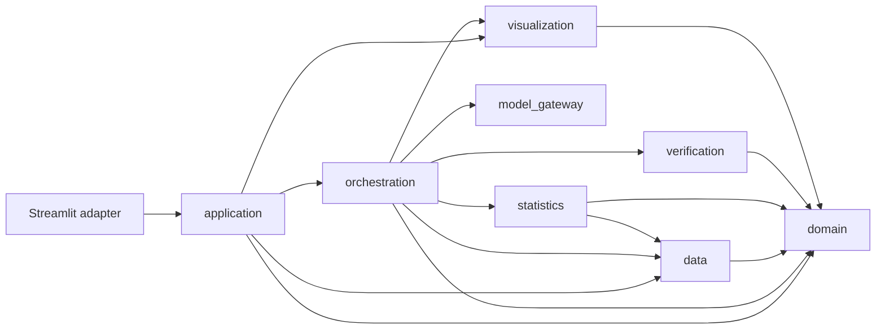
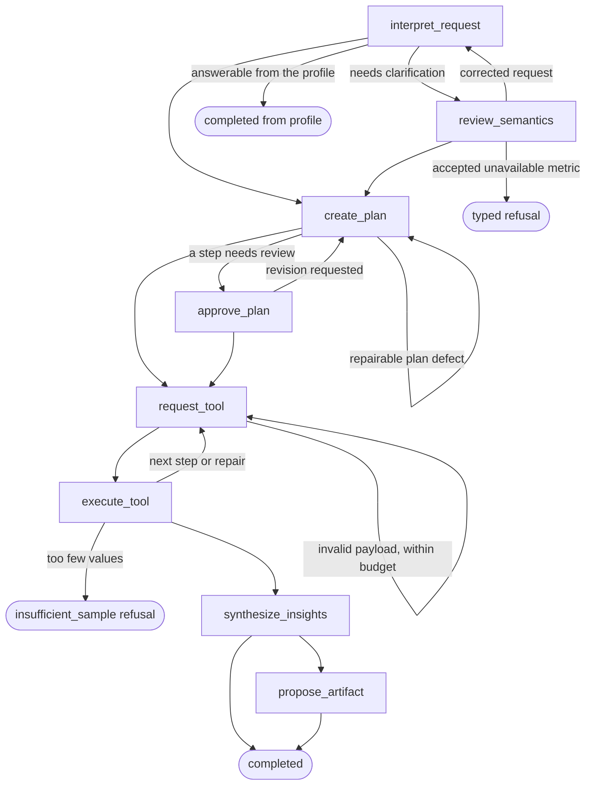

# Architecture

## Dependency direction

The `domain` module owns the shared language, contracts, and invariants. It has no dependency on
Streamlit, LangGraph, DuckDB, a model provider, or a storage technology. Streamlit and the model
provider are adapters at the edges, so a FastAPI front end or another model can replace them without
changing the analytical core.

## Agent workflow

Every node writes a checkpoint. Approval pauses are LangGraph interrupts, so a session resumes
after the application restarts. Human waiting time is excluded from the active run budget.

## Modules

### Domain

Validated Pydantic contracts: sessions, profiles, plans, Tool Actions, insight assertions, Verified
Insights, artifacts, and execution budgets. Cross-field invariants live here, and tests exercise the
contracts directly.

### Data

`TabularDataCore` is the single interface for inspecting, ingesting, profiling, and querying one
session's dataset.

- Uploads are checked for size, extension, encoding, header validity, and XLSX zip-bomb limits.
  Source copies are read-only and hash-bound; every read verifies the Working Dataset identity.
- Profiling infers field kinds, missing values, duplicates, outliers, identifier-like fields, and
  possible PII. A column whose values are all ISO dates is a datetime field in any language.
  Text values that differ only by case or surrounding spaces are flagged with examples; the data
  itself is never rewritten.
- `sql_policy` parses SQL with sqlglot and allows one `SELECT` or `WITH ... SELECT` over the session
  table. It rejects DDL, DML, external-access functions, wildcard projections, and other tables,
  rewrites field ids such as `c1` to exact quoted names, and gives unaliased calculated outputs
  deterministic ASCII aliases.
- DuckDB runs read-only with memory, row, and timeout limits. A timed-out query is interrupted.
- All limits come from `DataCoreLimits`, which `application/settings.py` reads from
  `TABULAR_AGENT_*` environment variables.

### Statistics

The engine implements descriptive statistics, correlation, confidence intervals, t and Mann-Whitney
tests, chi-square, ANOVA, Kruskal-Wallis, and linear and logistic regression with NumPy and SciPy.
Results record sample sizes, missing-data handling, assumption checks, p-values, Bonferroni-adjusted
alpha, effect sizes, and warnings. `StatisticalTool` reads only approved fields through the data
core, caps input with a seeded reservoir sample, and raises a typed `InsufficientSampleError` when a
test lacks data.

### Verification

`publish_insight` turns a typed assertion into a Verified Insight only when every gate passes: the
Tool Action succeeded and passed its own gates, the output reference identifies this result, the
dataset and Working Dataset version match, the fields exist, and the asserted metrics exist in the
evidence and satisfy the operator. Claim text is rendered from the evidence, so the model cannot add
numbers, direction, significance, or causal language. Failed drafts become Unsupported Claims.
Changing confirmed annotations or the dataset version marks earlier insights stale.

### Visualization

The renderer validates a Chart Intent against a verified query result (field existence and types,
encoding shape, result completeness, readability limits) and emits Plotly JSON. It never runs SQL
or aggregates values. `ArtifactStore` keeps Candidate and Pinned Artifacts in SQLite with immutable,
versioned render specifications, grounded to the current session dataset and annotations.

### Model gateway

`ModelGateway.generate_structured` takes a provider-neutral request and a Pydantic response schema,
validates the response, and allows one schema repair. The Gemini adapter adds bounded retries for
transient errors and rotates several API keys: each key serves up to 15 requests per minute, rests
65 seconds after that or after a rate-limit response, and a key the provider rejects is dropped.
`FakeModelGateway` replays queued outputs for tests.

### Orchestration

`AgentOrchestrator` exposes `start`, `resume`, and `get_state`. `graph.py` holds the nodes and
routes; supporting modules keep each concern small:

- `prompts.py` builds the delimited, escaped profile metadata. Field ids avoid miscopying non-ASCII
  names, and the sample-value option withholds frequent values.
- `binding.py` grounds requested-metric mappings in real fields, requires mapped inputs in the plan,
  binds each tool payload to its approved step, and rejects repeated identical Tool Actions.
  Counting rows or records needs no mapping and no identifier field.
- `evidence_catalog.py` bounds what reaches the model during synthesis: at most 200 evidence values,
  and for a longer query result only its first rows (at most 50, in query order), excluding results
  that read PII fields.
- SQL guidance tells the model that steps cannot read one another's results, so a question that
  uses one result to choose rows for another is written as one query with a CTE or subquery.
- `field_ids.py` resolves exact names and ids; `run_state.py` owns failure, refusal, repair, trace,
  and budget state transitions.

Synthesis publishes the model's drafts and then deterministically reports each statistical result's
headline estimates that the model left out: every group mean, or the single coefficient. Repairs are
bounded: a plan with unknown fields is replanned, a failed or empty filtered query is retried with
the exact error, and insight drafts that name unknown metrics are regenerated once.

### Application

`LocalAnalysisApplication` is the UI-neutral use-case boundary: staging uploads under a generated
session namespace, persisting the workspace atomically, opening the session checkpointer for each
agent operation, publishing charts, and deleting a session. Around it:

- `overview.py` builds the Data Overview and explorer from the profile and bounded read-only
  queries, with fixed design limits and no model call. Explorer field names are checked against
  eligible fields and filter values are escaped as SQL literals.
- `suggestions.py` proposes goals from field kinds; `exports.py` writes CSV and JSON bound to
  verified evidence; `settings.py` reads limits, budgets, and the sample-value option.

### Evaluation

Golden cases pin a dataset hash, the question, and expected values computed independently. The
runner uploads the dataset through the application, approves plans, and grades outcome,
calculations, insight coverage, schema grounding, forbidden claims, profile facts, and charts
(grading version 4). Provider errors are retried once and reported separately.

### Delivery

`streamlit_app.py` renders state and forwards user decisions through the application interface. It
holds no analytical logic.

## Testing rule

The public interface of each module is its test surface. Tests use real files, real DuckDB
databases, and real SQLite checkpoints in temporary directories, and `FakeModelGateway` in place of
a live model. `tests/test_hardening.py` covers resource limits, budgets, prompt injection, PII, and
recovery after a crash during tool execution.
